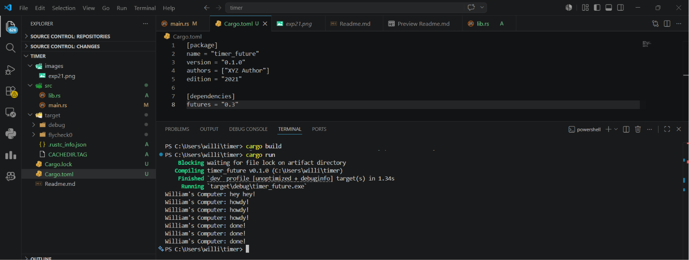

### Experiment 1.2

Pesan "Hey Hey" muncul lebih dahulu di terminal karena task yang dikirim melalui spawner belum langsung dijalankan. Spawner hanya berfungsi untuk memasukkan task ke dalam antrian, sedangkan eksekusi task dilakukan oleh executor ketika method run() dipanggil.\
Program dimulai ketika spawner menerima task, kemudian program langsung mengeksekusi print("Hey Hey") yang bersifat synchronous pada fungsi main. Setelah itu, spawner di-drop agar tidak ada task baru yang ditambahkan ke antrian. Selanjutnya, executor mulai menjalankan task yang ada, yaitu mencetak "howdy!", menunggu selama 2 detik, lalu mencetak "done!".

### Experiment 1.3

Dengan menambahkan beberapa spawner sebelum drop, seluruh task akan terlebih dahulu dimasukkan ke dalam antrian sebelum dieksekusi oleh executor. Saat method run() dipanggil, executor akan melakukan polling terhadap setiap task secara bergantian.\
Task pertama dijalankan hingga mencapai proses menunggu timer, kemudian executor berpindah untuk menjalankan task berikutnya.
Karena ketiga timer berjalan secara concurrent, waktu eksekusi total tetap sekitar 2 detik, bukan 6 detik. Hal ini terjadi karena proses penungguan pada setiap task berlangsung secara bersamaan, bukan secara sequential.\
Apabila drop(spawner) dihapus, executor tidak akan mengetahui bahwa sudah tidak ada task baru yang akan ditambahkan ke antrian. Akibatnya, executor akan terus menunggu task baru tanpa henti sehingga program tidak pernah selesai, meskipun seluruh task yang ada sebenarnya sudah berhasil dijalankan.