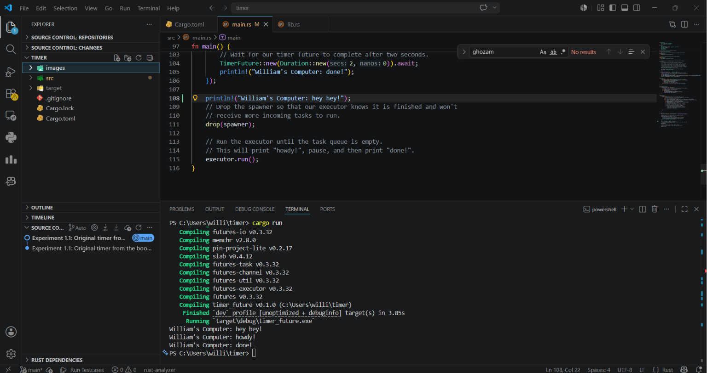

Pesan "Hey Hey" muncul lebih dahulu di terminal karena task yang dikirim melalui spawner belum langsung dijalankan. Spawner hanya berfungsi untuk memasukkan task ke dalam antrian, sedangkan eksekusi task dilakukan oleh executor ketika method run() dipanggil.
Program dimulai ketika spawner menerima task, kemudian program langsung mengeksekusi print("Hey Hey") yang bersifat synchronous pada fungsi main. Setelah itu, spawner di-drop agar tidak ada task baru yang ditambahkan ke antrian. Selanjutnya, executor mulai menjalankan task yang ada, yaitu mencetak "howdy!", menunggu selama 2 detik, lalu mencetak "done!".